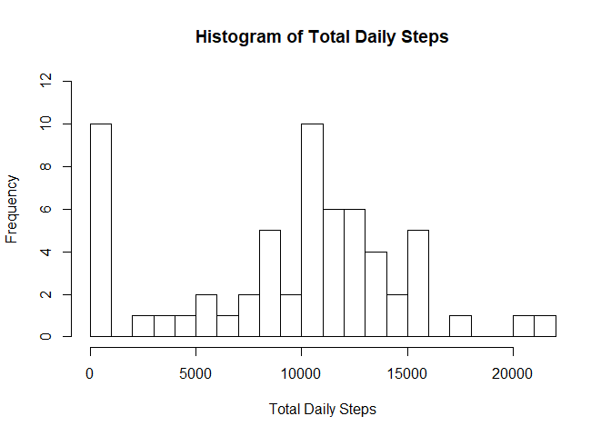
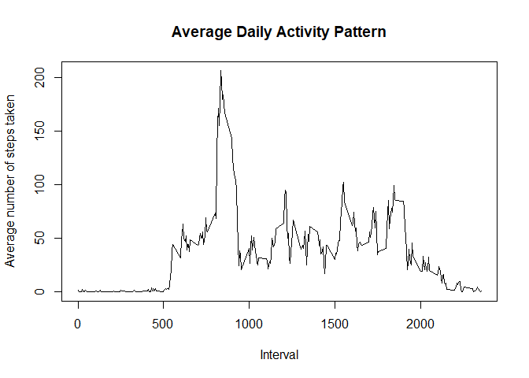
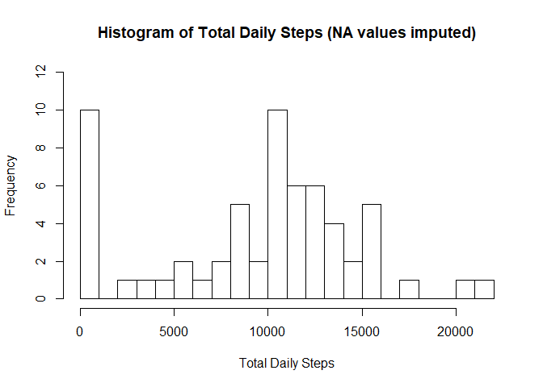
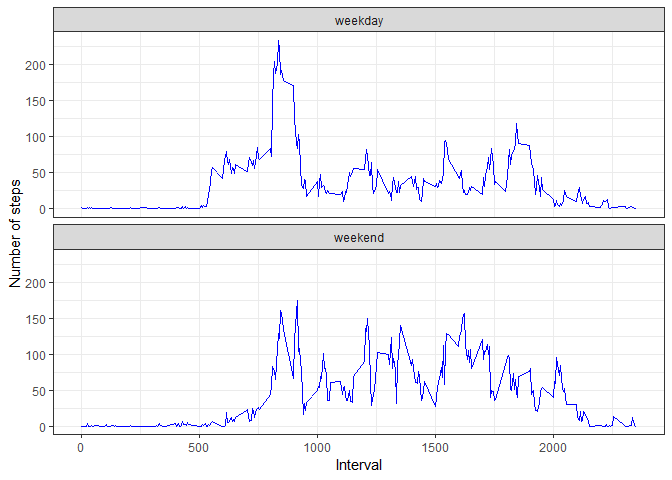

## Loading and preprocessing the data

```r
#unzip the source data file
unzip("./activity.zip")

# load the data file
activity <- read.csv("./activity.csv")
```


## What is mean total number of steps taken per day?

```r
#Get Total Daily Steps and Plot
totalDailySteps <- tapply(activity$steps, activity$date, sum, na.rm=TRUE)
hist(totalDailySteps, breaks=20, ylim=c(0,12), xlab="Total Daily Steps", main="Histogram of Total Daily Steps")
```

<!-- -->

```r
#Mean of Total Daily Steps
mean(totalDailySteps)
```

```
## [1] 9354.23
```

```r
#Median of Total Daily Steps
median(totalDailySteps)
```

```
## [1] 10395
```


## What is the average daily activity pattern?


```r
dailyPattern <- tapply(activity$steps, activity$interval, mean, na.rm=TRUE)
plot(rownames(dailyPattern), dailyPattern, type='l', xlab="Interval", ylab="Average number of steps taken", main="Average Daily Activity Pattern")
```

<!-- -->

```r
#Interval with the maximum number of steps
names(which.max(dailyPattern))
```

```
## [1] "835"
```

## Imputing missing values

Missing values were imputed by the following strategy:

* setting the **NA** value to the **mean** of the steps taken for that day
* if the **mean** for that day is still **NA**, the missing value is set to **0**


```r
#number of rows with missing values
sum(!complete.cases(activity))
```

```
## [1] 2304
```

```r
#create new dataset
newActivity <- activity

#create impute function using means for the specific day
dailyMeans <- tapply(activity$steps, activity$date, mean, na.rm=TRUE)
#set daily mean to 0 if mean NA
dailyMeans <- ifelse(is.na(dailyMeans), 0, dailyMeans)

impute <- function(date) { return(dailyMeans[date]) }

#impute NA values 
newActivity$steps <- ifelse(is.na(newActivity$steps), impute(newActivity$date), newActivity$steps)

newTotalDailySteps <- tapply(newActivity$steps, newActivity$date, sum)
hist(newTotalDailySteps, breaks=20, ylim=c(0,12), xlab="Total Daily Steps", main="Histogram of Total Daily Steps (NA values imputed)")
```

<!-- -->

By using the impute strategy above, the **mean** and **median** values for the total number of steps taken per day of the new dataset is similar to the original dataset.


```r
#Mean of New Total Daily Steps
mean(newTotalDailySteps)
```

```
## [1] 9354.23
```

```r
#Median of New Total Daily Steps
median(newTotalDailySteps)
```

```
## [1] 10395
```

There is no impact on imputing the missing values using the above strategy.

* the **mean** of the total number of steps taken per day is **the same**
* the **median** of the total number of steps taken per day is **the same**
* the total number of steps taken per day is **the same**

## Are there differences in activity patterns between weekdays and weekends?


```r
#add weekday column
activity <- activity %>% mutate(weekday = ifelse(weekdays(as.Date(date)) %in% c("Sunday", "Saturday"), 'weekend', 'weekday')) %>% mutate(weekday=as.factor(weekday))

weekdayActivity <- activity %>% group_by(weekday, interval) %>% summarize(steps=mean(steps, na.rm=TRUE))

#Plot weekday vs weekend
g <- ggplot(weekdayActivity, aes(interval, steps))
g + geom_line(col="blue") + facet_wrap(~weekday, ncol=1) + labs(x="Interval", y="Number of steps") + theme_bw() 
```

<!-- -->
